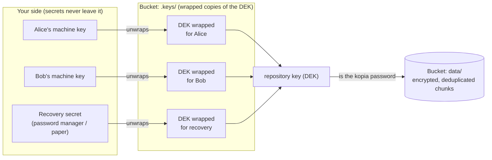
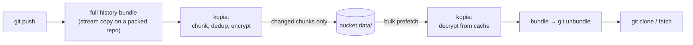

# git-remote-s3vault

A git remote helper that stores repositories in any **S3-compatible
object store** (Cloudflare R2, MinIO, AWS S3, Garage, …),
**end-to-end encrypted and deduplicated** — age-based key management on
top of kopia's storage engine.

```console
$ git remote add origin s3vault://my-bucket/my-repo
$ git push origin main
$ git clone s3vault://my-bucket/my-repo
```

> [!WARNING]
> **Losing your keys means losing the repository.** This is real
> end-to-end encryption: there is no password reset, no provider-side
> recovery, no backdoor. Always keep at least one of — a granted machine
> key (`~/.config/git-remote-s3vault/identity.txt`) or the **recovery
> secret** printed once during setup. If every key is gone, the remote is
> permanently unreadable; your only way back is a surviving local clone
> (re-push it under a new key). Since every git clone is a complete copy,
> keeping the repository cloned on **at least two machines** is a cheap
> last-resort backup against both key loss and bucket loss.

## Why this instead of [git-remote-s3](https://github.com/awslabs/git-remote-s3)?

- **Single static binary.** Written in Go — no Python, no pip, no runtime.
  Drop `git-remote-s3vault` on your `PATH` and git finds it.
- **Encrypted before it leaves your machine — not just SSE.**
  git-remote-s3 relies on S3 server-side encryption, where the provider
  performs the decryption: anyone with `s3:GetObject` (+ `kms:Decrypt`)
  reads plaintext. Here everything is encrypted client-side, by default,
  always; keys are managed sops-style with
  [age](https://age-encryption.org) (grant a teammate with one command, a
  printed recovery key restores access from nothing). The storage provider
  sees only opaque ciphertext — not even branch names — and bucket
  credentials alone yield nothing readable. Nobody in the storage path can
  content-scan, filter, or mine what you push (see the threat model for
  the honest limits).
- **Deduplicated.** Data rides on [kopia](https://kopia.io)'s
  content-defined chunking: pushes upload only changed chunks, and tags or
  branches sharing history cost almost nothing.
- **Any S3-compatible backend, no special cases.** One endpoint URL is
  the whole backend configuration: Cloudflare R2, MinIO, AWS S3, Garage,
  Ceph, … all through the same binary.
- **Tested for real.** The e2e suite spins up MinIO in a testcontainer and
  drives the compiled binary through actual `git push`, `clone`, `pull`,
  force-pushes, tags, branch deletion, key grants, disaster recovery, and
  measured deduplication.

## Install

```console
$ go install github.com/osjupiter/git-remote-s3vault/cmd/git-remote-s3vault@latest
```

or grab a [release binary](https://github.com/osjupiter/git-remote-s3vault/releases)
(linux / macOS amd64+arm64, Windows amd64) and put it on your `PATH` —
on Windows that's `git-remote-s3vault.exe`, which git discovers the same
way. Remote URLs use the `s3vault://` scheme. Optionally symlink the
binary as `git-remote-s3` to also serve plain `s3://` URLs (note: that
name collides with awslabs' git-remote-s3 if you have it installed).

## Quick start

From inside any existing repository, run setup with no arguments and
answer the wizard — it asks for the endpoint, credentials, and bucket,
generates the encryption keys, registers the remote, and checks that the
bucket is reachable:

```console
$ git-remote-s3vault setup
Interactive setup — Enter accepts the [default].

S3 endpoint URL (R2: https://<account>.r2.cloudflarestorage.com, empty: AWS S3): https://abc123.r2.cloudflarestorage.com
Bucket name: my-bucket
Credentials — tip: use an API token scoped to ONLY the target bucket
(Object Read & Write), so a leaked key cannot touch anything else.
Access Key ID (empty to configure later): ...
Secret Access Key:
Prefix inside the bucket [my-repo]:
Remote name [origin]:
Which key should be able to decrypt this repository?
  1) age key age1ql3z7hjy54pw3hyw… (~/.config/git-remote-s3vault/identity.txt)
  2) SSH key ssh-ed25519 you@laptop (~/.ssh/id_ed25519)
  3) Generate a new age key
Key [1]:
Create remote "origin" → s3vault://my-bucket/my-repo? [Y]:
...
```

The key list offers every age key in your machine-key file and any
decryption-capable SSH key under `~/.ssh` (passphrase-protected SSH keys
are not supported and are skipped). With no existing keys, a fresh age
key is generated without asking.

Passing the URL directly skips the wizard (handy for scripts):

```console
$ export AWS_ENDPOINT_URL=https://<account>.r2.cloudflarestorage.com

$ git-remote-s3vault setup s3vault://my-bucket/my-repo
✓ generated this machine's key (age identity): ~/.config/git-remote-s3vault/identity.txt
✓ added remote "origin" → s3vault://my-bucket/my-repo
✓ 1 recipient(s) configured (1 added)

No S3 credentials found (checked the environment and ~/.config/git-remote-s3vault/credentials).
Tip: create an API token scoped to ONLY this bucket (Object Read & Write),
     so that a leaked key cannot touch anything else.

Access Key ID (leave empty to skip): ...
Secret Access Key:
✓ credentials saved to ~/.config/git-remote-s3vault/credentials [endpoint:... bucket:my-bucket]
✓ bucket reachable; remote is empty (first push will initialize it)
✓ repository key created; wrapped for 1 public key(s)
✓ recovery key created — store this line in a password manager or on paper:

    AGE-SECRET-KEY-1...

  It will NOT be shown again. Anyone holding it can decrypt this repository.

All set. Next:
  git push -u origin main

$ git push -u origin main
```

Setup remembers the token in `~/.config/git-remote-s3vault/credentials`
(plaintext, 0600 — the same trust model as other credential files), one
entry per bucket, matching the one-token-per-bucket model. Wizards never
ask twice: saved credentials skip the question, and when the store knows
exactly one endpoint it becomes the endpoint default.

Useful flags: `--remote <name>`, `--recipient <age1...>` (repeatable; add
teammates or CI public keys), `--endpoint <url>`, `--identity <path>`,
`--encryption none`, `--no-verify`.
Re-running setup is safe and idempotent — run it again to add recipients or
repoint the remote.

Adding a teammate later is one command (see "How it works" below):

```console
$ git-remote-s3vault key grant age1<their-public-key>
✓ access granted (no re-encryption needed — existing history is immediately readable)
```

## Cloning

On a machine that already has access (a granted machine key + saved
credentials), cloning is just git:

```console
$ git clone s3vault://my-bucket/my-repo
```

For a machine that has nothing yet, run `git-remote-s3vault clone` with no
arguments and answer the wizard (same style as `setup` — endpoint,
credentials, bucket, prefix, target directory):

```console
$ git-remote-s3vault clone
Interactive clone — Enter accepts the [default].

S3 endpoint URL (R2: https://<account>.r2.cloudflarestorage.com, empty: AWS S3): ...
Bucket name: my-bucket
Access Key ID (empty to configure later): ...
Secret Access Key:
Prefix inside the bucket: my-repo
Clone into directory [my-repo]:
Clone s3vault://my-bucket/my-repo into "my-repo"? [Y]:
```

It prepares everything a plain `git clone` would need — machine key,
credentials, access check — and tells you exactly what's missing instead
of failing with a cryptic decryption error:

```console
$ git-remote-s3vault clone s3vault://my-bucket/my-repo
✓ generated this machine's key (age identity): ~/.config/git-remote-s3vault/identity.txt
✗ this machine's key has no access to the repository yet.

  Your public key:
    age1nEw...

  Ask a member to run, inside their clone of this repository:
    git-remote-s3vault key grant age1nEw...

  Or, if you hold the recovery key:
    git-remote-s3vault key recover s3vault://my-bucket/my-repo

# ...after a member runs the grant (or you run `key recover`):
$ git-remote-s3vault clone s3vault://my-bucket/my-repo
✓ access confirmed
Cloning into 'my-repo'...
```

Credentials are prompted for (and remembered) when needed, and the
backend settings are written into the fresh clone's repo config, so from
then on every git command just works. `--endpoint` / `--identity` flags
are available as with `setup`.

### Recovery key & disaster recovery

When setup initializes a repository it also mints a **recovery key** and
prints its secret exactly once:

```
✓ recovery key created — store this line in a password manager or on paper:

    AGE-SECRET-KEY-1....

  It will NOT be shown again.
```

Store that one line somewhere durable — this is end-to-end encryption,
so **if every machine key AND the recovery secret are lost, nobody can
restore access** (see the warning at the top). With it stored safely,
losing every device is a non-event — a brand-new machine needs only the
recovery secret and the URL:

```console
$ git-remote-s3vault key recover s3vault://my-bucket/my-repo
recovery key (AGE-SECRET-KEY-...):
✓ generated this machine's key (age identity): ~/.config/git-remote-s3vault/identity.txt
✓ this machine's key now has access
$ git clone s3vault://my-bucket/my-repo
```

`recover` mints a fresh machine key and grants it access using the
recovery key, so the recovery secret goes straight back in the drawer.

The recovery key is deliberately **asymmetric** (a keypair, not a
passphrase): its public half lives in the bucket
(`.keys/dek/recovery.pub`), which means a future key rotation can re-wrap
the new repository key for it *without knowing any secret*. A
passphrase-based (symmetric) recovery scheme cannot do that — rotation
would stall waiting for someone to type the passphrase.

`git-remote-s3vault key recovery-init` mints a replacement recovery key at any
time (the old secret stops working). For non-interactive use set
`GIT_REMOTE_S3VAULT_RECOVERY_KEY`.

Even without a recovery key, all is not lost while any clone survives:
generate a new key and force-push every ref to re-encrypt the remote.

### Without the setup command

`setup` is a convenience, not a requirement. If a machine key exists (any
age identity file works — `age-keygen` output is fine) and the helper can
find at least one public key, the first push initializes the repository
key by itself:

```console
$ age-keygen -o ~/.config/git-remote-s3vault/identity.txt
$ git remote add origin s3vault://my-bucket/my-repo
$ git push origin main   # repository key is created here, wrapped for your key
```

The machine key at `~/.config/git-remote-s3vault/identity.txt` and any public
keys listed in `~/.config/git-remote-s3vault/recipients.txt` (or in the
`s3vault.ageRecipients` git config) are picked up automatically. Note that this
path creates **no recovery key** — run `git-remote-s3vault key recovery-init`
afterwards if you want one.

## Configuration

Everything can be set per-remote (`remote.<name>.<key>`), globally
(`s3vault.<key>`), or by environment variable. Precedence: **env > remote-scoped
git config > global git config**.

| git config key | environment | meaning |
|---|---|---|
| `s3vault.endpoint` | `AWS_ENDPOINT_URL[_S3]`, `GIT_REMOTE_S3VAULT_ENDPOINT` | S3 endpoint URL; empty means AWS S3 (R2: `https://<account>.r2.cloudflarestorage.com`) |
| `s3vault.region` | `AWS_REGION` | region (default `us-east-1`; R2 accepts it) |
| `s3vault.usePathStyle` | `GIT_REMOTE_S3VAULT_PATH_STYLE` | path-style addressing; auto-detected for self-hosted endpoints |
| `s3vault.ageRecipients` (multi) | `GIT_REMOTE_S3VAULT_AGE_RECIPIENTS` (comma-sep) | public keys (`age1...` / `ssh-...`) granted access when the repository key is first created; afterwards use `key grant` |
| `s3vault.ageRecipientsFile` | `GIT_REMOTE_S3VAULT_AGE_RECIPIENTS_FILE` | file with one such public key per line |
| `s3vault.ageIdentityFile` | `GIT_REMOTE_S3VAULT_AGE_IDENTITY_FILE` | this machine's key (age identity or SSH private key), used to unwrap the repository key |
| `s3vault.encryption` | `GIT_REMOTE_S3VAULT_ENCRYPTION` | `age` (default) or `none` (explicit opt-out) |

### Credentials

Two sources, checked in order — nothing else is ever consulted (no
`~/.aws/credentials`, no shared config, no instance roles):

1. environment — `AWS_ACCESS_KEY_ID` / `AWS_SECRET_ACCESS_KEY`
   — the same AWS-shaped key pair for every backend
2. `~/.config/git-remote-s3vault/credentials` — written by `setup`, strictly
   one entry per bucket (`[endpoint:<url> bucket:<name>]`), no fallback

If neither yields a key pair, the helper fails with instructions instead
of silently probing other credential sources.

Use **bucket-scoped API tokens** (Object Read & Write on a single
bucket): a leaked key then can't reach anything but that bucket's
ciphertext. Never commit credentials into the repository — the working
tree travels with every clone; this store does not.

### MinIO / self-hosted S3 example

```console
$ export AWS_ENDPOINT_URL=http://127.0.0.1:9000
$ export AWS_ACCESS_KEY_ID=minioadmin AWS_SECRET_ACCESS_KEY=minioadmin
$ git clone s3vault://my-bucket/my-repo
```

## How it works

### Two layers: age for keys, kopia for data

The bucket holds two things, cleanly separated:

```
<prefix>/.keys/repo.pub           # DEK public key (plaintext — it's public)
<prefix>/.keys/dek/<label>.age    # DEK, wrapped to one member key (age)
<prefix>/.keys/dek/<label>.pub    # that member's public key (for `key list`)
<prefix>/.keys/generation         # which data generation is active
<prefix>/data/...                 # kopia repository: opaque encrypted blobs
                                  # (data2/, data3/, … after key rotations)
```

**Key layer (age, sops-style).** Every repository gets its own
**data-encryption key (DEK)**, generated on setup / first push. It is
stored in the bucket wrapped once per member public key. Granting access
is O(1): wrap the DEK for one more key and the entire existing history
becomes readable instantly, with no re-encryption and no re-push. Repos
stay isolated — one machine key serves every repo without coupling them.



```console
$ git-remote-s3vault key grant age1<teammate> ; git-remote-s3vault key list ; git-remote-s3vault key revoke <label>
```

`key revoke` removes a member's ability to unwrap the DEK in the future,
but anyone who already unwrapped it may have cached it. For a hard
cut-off, rotate:

```console
$ git-remote-s3vault key rotate
```

Rotation re-encrypts the **entire repository under a brand-new key**
(including a new kopia master key — a mere password change would not
help, since kopia's password only wraps its master key), blue/green
style: the next data generation (`data2/`, `data3/`, …) is built side by
side while the remote stays fully usable, every member slot and the
recovery key are re-wrapped (teammates and the recovery secret keep
working with no action), then a single small pointer write flips the
remote over and the old generation is deleted. Every phase is idempotent
and an interrupted rotation either leaves the remote untouched
(pre-flip; re-running resumes incrementally) or fully working with only
garbage to sweep (post-flip). Rotation also acts as a **full repack**:
force-push debris and deleted branches are garbage-collected by it.
After rotating, also reissue the bucket's S3 API token — a removed
member who kept cached key material can do nothing without ciphertext
access.

**Data layer ([kopia](https://kopia.io)'s repository engine).** Each push
stores a self-contained git bundle of the ref's full history as a kopia
object; refs and HEAD are kopia manifests. The DEK is the kopia
repository password. kopia provides content-defined chunking with
**deduplication**, AES-256-GCM encryption, packing, and local caching
(under `~/.cache/git-remote-s3vault/`) — so although every push writes a
"full" bundle, only the chunks that actually changed are uploaded and
stored. Measured in the e2e suite: on a ~3 MB repository, pushing a tag
adds ~5 KB and a small commit ~300 KB.



- Branches and tags cost almost nothing: shared history is stored once.
- Pushes enforce fast-forward unless `--force` is used (ancestry is
  checked locally against the advertised remote sha).
- `list`/`fetch` need no local bookkeeping: git's own object database
  answers "do I already have this?".
- The local cache (`git-remote-s3vault cache path`) is bounded per remote
  and safe to delete at any time: `git-remote-s3vault cache clean`.

### Threat model

Repository **contents** (commits, trees, blobs, messages, file names, ref
names) are encrypted end-to-end; the DEK never exists unencrypted outside
your machines. The storage provider sees only: opaque blob names, blob
count/sizes, access timing, the fact that the format is kopia, and the
keyring metadata (how many member slots exist and their public keys).
Ref names and commit hashes are **not** visible.

In practice, that means the provider (or anyone who obtains bucket
access) technically **cannot**:

- read or scan your code and history, or content-filter / selectively
  censor it — there is no plaintext to inspect
- leak anything readable in a bucket breach — stolen objects are
  ciphertext without the keys
- mine, index, or train on your repository contents

And, to be equally clear about what E2EE does **not** prevent: the
provider can still delete your data or refuse service outright (keep
clones — every clone is a full copy), and metadata (object sizes, access
timing, your account identity) remains visible.

### Caveats

- Pushing creates a full bundle locally even though only deltas are
  uploaded. On a **packed** repository this is a stream copy (measured:
  0.4s for a 188MB repo); on a repository full of loose objects git
  re-compresses everything (20x slower — the helper detects this and
  suggests running `git gc`). The storage format would also allow
  incremental bundles later without a breaking change.
- Storage grows by roughly the changed bytes per push; deleted branches
  and force-push debris are reclaimed by `key rotate`, which doubles as a
  full repack. Do **not** run kopia's own maintenance against the bucket
  — it does not know about the helper's manifests.
- Two clients force-pushing the same ref at the same instant race
  last-writer-wins; the ref converges to one of them (nothing is lost —
  the other side's commits stay in their local clone and the next push
  surfaces the divergence). Repository-key initialization and rotation
  generation flips are guarded with lock-free conditional writes
  (compare-and-swap; supported by R2, AWS S3, and recent MinIO, with a
  plain-write fallback elsewhere), so concurrent setups or rotations
  cannot corrupt key material.

## Development

```console
$ make test        # unit tests
$ make e2e         # full git flows against MinIO (needs Docker)
$ make build
```

## Inspired by

- [git-remote-s3](https://github.com/awslabs/git-remote-s3) (awslabs) —
  the bundles-in-a-bucket git remote this project started from
- [git-remote-gcrypt](https://spwhitton.name/tech/code/git-remote-gcrypt/)
  — the pioneer of encrypted git remotes
- [sops](https://github.com/getsops/sops) — the envelope-encryption key
  management model (per-repo data key, wrapped per member)
- [age](https://age-encryption.org) — the key wrapping and recovery-key
  cryptography
- [kopia](https://kopia.io) — the deduplicating encrypted storage engine
  the data layer rides on
- [aws-vault](https://github.com/99designs/aws-vault) — the "vault"
  naming lineage

## License

MIT
